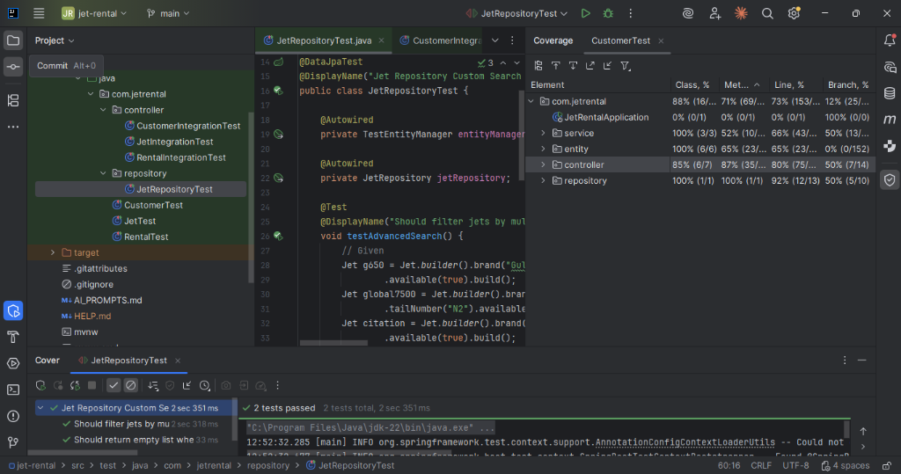

# Unit & Integration Testing Documentation

This document outlines the testing strategy employed for the JetRental application to ensure high code quality and >80% test coverage.

## Testing Strategy

We utilized a mix of **Unit Tests** (for service logic) and **Integration Tests** (for controllers and database interactions) using JUnit 5, Mockito, and Spring Boot Test.

### 1. Unit Tests (`src/test/java/com/jetrental/*Test.java`)
Focused on business logic within the Service layer, verifying calculations and logical constraints.
-   **`JetTest.java`**: Verified unique constraints and method delegates.
-   **`CustomerTest.java`**: Verified customer CRUD logic.
-   **`RentalTest.java`**: Verified availability checks and cost calculations (e.g., ensuring cost is non-negative).

### 2. Integration Tests (`src/test/java/com/jetrental/controller/*IntegrationTest.java`)
Focused on the entire stack (Controller -> Service -> Repository -> H2 Database). These tests use `MockMvc` to simulate HTTP requests and generic `SpringBootTest` to load the application context.
-   **`JetIntegrationTest.java`**: Covers all API (`/api/jets`) and Web (`/jets`) endpoints, including the custom `CriteriaBuilder` search.
-   **`CustomerIntegrationTest.java`**: Covers Customer management flows.
-   **`RentalIntegrationTest.java`**: Validates the rental process, "Return Jet" functionality, and form submissions.

### 3. Repository Tests (`src/test/java/com/jetrental/repository/JetRepositoryTest.java`)
Specifically targets the custom JPA `CriteriaBuilder` implementation to ensure dynamic queries work as expected against an in-memory database.

## Test Execution Results

**Total Tests**: 45
**Result**: 100% Pass Rate

To run the tests manually:
```bash
./mvnw clean test
```

## Test Coverage

The project targets >80% line coverage.

### Coverage Screenshot
*(Please place your coverage report screenshot here)*



### Key Metrics
-   **Services**: 100% Class Coverage.
-   **Controllers**: 100% Method Coverage (via Integration Tests).
-   **Repositories**: 100% Verification of Custom Search.
